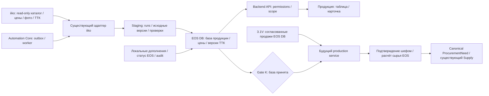

# EnterpriseOS — архитектура Stage 3.2

**Тип:** ARCHITECTURE PROPOSAL · **Версия:** 0.1.0 · **Дата:** 08.10.2026
**Статус:** на review. Обозначения и бизнес-правила — в
[спецификации](STAGE_3_2_PRODUCT_KNOWLEDGE_AND_PRODUCTION_SPEC.md).
CURRENT 09.10.2026: K2 развёрнут по подтверждению владельца; K3 обычные цены
реализованы локально и подготовлены к публикации, см. K3 continuation ниже.
Целевая часть K4–K6 и непроверенные SCHEDULED precedence остаются предложением. Реализованный K1 и отличия
зафиксированы в разделе «K1 implementation» в конце документа.

## 1. Проверенная локальная основа

Исследован checkout `64d4807e0e26c88d627c0509a2b7ad7461485884`, ветка `main`;
до работы дерево чистое. Production HEAD, Alembic и данные не проверялись.
Датированная production-запись в CODEX_CONTEXT не является текущим live preflight.

| Компонент и доказательство в коде | Повторное использование и ограничения |
|---|---|
| [`IikoProvider`](../backend/api/app/integrations/iiko/provider.py), [`IikoServerClient`](../backend/api/app/integrations/iiko/client.py), config/exceptions/observability рядом | Аутентификация, закрытие токена, timeout/error boundary и чтение справочников. Не новый HTTP-клиент. Клиент содержит и write-методы: часть I использует только явный read allowlist |
| [`IikoProductDto`, groups/categories/units/packages](../backend/api/app/integrations/iiko/schemas.py), [`mapper`](../backend/api/app/integrations/iiko/mapper.py) | UUID/название/код/SKU/тип/группа/категория/единица/признаки источника. Вес, цена, фото, денежная себестоимость и рецептура не являются текущими нормализованными полями DTO |
| [`IikoSyncRun`, `IikoRawEntity`](../backend/api/app/models/iiko.py), [`stage_records`, `sync_reference_snapshot`](../backend/api/app/integrations/iiko/service.py) | Журнал запусков, безопасные исходные данные, hash-версии. Полный snapshot может завершиться частично; это staging, не готовая карточка |
| [`SupplyProduct`, `SupplyUnit`, `SupplyProductCategory`, `Department`](../backend/api/app/models/supply.py) | Существующая внутренняя идентичность, единицы, категории EOS, RETAIL_POINT/PRODUCTION и legal contour. Категории iiko отдельно от категорий EOS; их нельзя автоматически отождествлять |
| [`IikoProductMapping`, `IikoUnitMapping`, `IikoWarehouseMapping`](../backend/api/app/models/iiko.py), [`mapping_service`](../backend/api/app/integrations/iiko/mapping_service.py) | Подтверждённые ID-связи и очереди конфликтов. Существующие name-based suggestions не являются доказательством для автоматического объединения новых изделий |
| [`SalesFact`, `SalesDaySync`, `SalesSyncState`, `SalesPeriodSnapshot`](../backend/api/app/models/sales.py), [`reconciliation_facts`, `reconcile`](../backend/api/app/sales/service.py), [`metrics`](../backend/api/app/sales/metrics.py) | Продажи из EOS DB, возвраты, scopes, completeness/freshness. `product_id` nullable с FK к SupplyProduct; `iiko_product_id` сохранён. KPI-контракт не меняется |
| [`seller_requests`, `seller_versions`](../backend/api/app/supply/seller_versions.py), [`procurement_needs`](../backend/api/app/supply/procurement_needs.py), purchase_requests/stock_calculation | Паттерн последнего confirm, окон и canonical потребностей. Это материальная Supply-заявка; новую production-заявку нельзя объявить готовой на её основании |
| [`authorization`](../backend/api/app/core/authorization.py), ActionContext, Employee/User | Фиксированные роли, tenant/scope, `authorized_as`, `allowed_actions`; новые capability требуют отдельной реализации/приёмки |
| [`AuditEvent`](../backend/api/app/models/audit.py), [`audit.service`](../backend/api/app/audit/service.py), [`0061`](../backend/api/alembic/versions/20260929_0061_add_immutable_business_audit.py) | Append-only аудит, SYSTEM/HUMAN, before/after и snapshots; PostgreSQL trigger запрещает UPDATE/DELETE |
| [`supplier_payments`](../backend/api/app/supply/supplier_payments.py), [`photo routes`](../backend/api/app/api/routes/supplier_payments.py), [`requests`](../backend/api/app/api/routes/requests.py) | Файлы/фото и защищённая выдача уже есть. Payment-specific поля/каталоги не являются общим media-cache: повторить безопасные приёмы, не привязывать фото изделия к оплате |
| [`local_actions`](../backend/api/app/automation/local_actions.py), scheduler/outbox/dispatch/executions | Уже выполняются локальные iiko shift/sales sync. Добавить действие к существующему контуру, не второй scheduler/retry engine |
| [`App`](../frontend/src/App.tsx), [`ProtectedRoute`](../frontend/src/components/ProtectedRoute.tsx), [`EosFormControls`](../frontend/src/components/EosFormControls.tsx), [`EosDialog`](../frontend/src/components/EosDialog.tsx) | Routing, форма, диалоги и существующие table/page CSS. Без новой UI-библиотеки |
| [`SupplyProductionProcurementPage`](../frontend/src/pages/SupplyProductionProcurementPage.tsx) | Read-only закупки по существующим заявкам производства; не план выпуска и не ТТК |

## 2. Границы и поток

Схема целевая: цены/фото/ТТК ещё требуют разведки. UI не обращается в iiko.
EOS владеет классификацией, статусом, описаниями, валидацией, расчётами и audit.
iiko — источник внешних фактов. Согласно ADR-002, прямой адаптер EOS к iiko
допустим; для фоновых запусков используется существующий local handler Automation
Core. Если выбран n8n, только `AutomationProvider → локальный n8n → authenticated
callback` с execution_id, transactional outbox и идемпотентностью; не прямой DB
доступ и не NL VPS. Новый workflow на каждое расписание не создаётся.

## 3. Идентичность и модель данных (Q07)

Предпочтительный вариант — сохранить `SupplyProduct.id` как общую EOS-идентичность
и добавить профиль готовой продукции 1:1. Это расширение существующего продукта,
а не второй несвязанный каталог. Уже связанные продажи/закупки не перепривязывать
по имени. Полная номенклатура iiko остаётся во внешнем staging.

| Предлагаемая структура | Основные поля и ограничения |
|---|---|
| `ProductKnowledgeProfile` → SupplyProduct | tenant/product составной FK RESTRICT, unique product; classification + revision, `sale_status` EOS, локальные description/allergens/storage/training, `sale_mode`/вес с provenance; `version` для optimistic locking |
| Source projection / current pointer | tenant, подтверждённый integration source, product UUID iiko, current raw/version reference, source fields, last_seen/success, quality; unique tenant/source/UUID; привязка к профилю только по подтверждённым IDs |
| `ProductSourceObservation` или manifest успешного snapshot | run → entity/version и факт присутствия в конкретном запуске. Нужен учёт неизменённых записей, отсутствия и порядка наблюдений |
| `ProductPriceVersion` | product, Department, внешний ценовой контекст/приказ, valid_from/to, observed_at, amount Decimal, currency, price_unit, источник/version; неизменяемые версии, отсутствие конфликтующих активных цен в согласованном контексте |
| `ProductMedia` | tenant/product, source image reference/hash, content hash, MIME, размер, cache path, fetched_at, quality; ссылка из профиля, файл вне публичной раздачи |
| `ProductRecipeVersion` | product, source chart ID/version, область действия, effective date, выход/единица, tree/prepared representation, payload_hash, observed_at; ингредиенты с внешними IDs и подтверждёнными unit mappings |
| `ProductCostObservation` (условно после Q05) | product, method, date/period, department/store, unit, amount/currency, источник/версия, статус проверки. Без подтверждённого контракта не создавать числовую «стоимость по умолчанию» |

Разделение профиля, цен и ТТК обосновано разной кардинальностью/версионностью и
разными правами. Таблицы с точными именами/nullable constraints утверждаются
перед соответствующим слайсом; это не готовая Alembic-модель.

**Ограничения текущей модели:**

- `SupplyProduct.iiko_id` — строка, unique в tenant; `IikoProductMapping` хранит
  UUID. Сверить согласованность обеих связей; конфликт не лечить last-write-wins.
- `normalized_name` уникально в tenant. Два разных UUID с одинаковым именем нельзя
  склеивать или переименовывать техническими суффиксами. Q07: возможна целевая
  миграция ограничения только после оценки alias/parser/Supply consumers.
  Альтернатива отдельного source-first identity допускается лишь с обоснованием
  и явной связью с SupplyProduct, без дублирования бизнес-продукта.
- `default_unit_id` обязательна; при неизвестной единице импортировать только
  source staging, не создавать фиктивную единицу/готовый профиль.
- `SupplyProduct.is_active`/archive — действующий lifecycle Supply, не `sale_status`.
  Новый статус не архивирует SupplyProduct, не меняет существующие фильтры Supply.
- Текущие raw/mapping keys не включают `source_id`. Если в tenant несколько
  каталогов iiko, нужен отдельный identity decision/миграция, а не предположение
  их UUID-пространств одинаковыми (Q08).

## 4. Отбор и приоритет данных

Правило готовой продукции — versioned решение EOS на основе подтверждённых
типов/групп/категорий/точечных исключений iiko. Значения enum не угадывать до P02.
Явно отделить изделия от сырья, полуфабрикатов, модификаторов, услуг, упаковки
и закупных перепродаж; крайние случаи проверяет владелец ассортимента.
Название, `defaultIncludedInMenu`, единица или факт продажи по отдельности не
доказывают классификацию. Сохранить rejected/unresolved IDs и причины в staging.

| Данные | Владелец / поведение resync |
|---|---|
| Source UUID/name/type/weight/unit/group/image/price/ТТК | iiko-факты обновляются только подтверждённым snapshot; предыдущая версия сохраняется |
| Статус ассортимента, локальные тексты, подтверждённые аллергены/хранение, category EOS | EOS; sync не перезаписывает |
| Локальное уточнение source-поля | Отдельный override с автором/причиной; показать оба источника; не включать автоматически в ТТК-расчёт |
| `deleted`/missing/menu flags | Только source quality; ни переключения статуса EOS, ни физического удаления |
| SalesFact/снимки утверждённых решений | Старые значения не переписываются при переименовании/выводе изделия |

## 5. Синхронизация и версионирование

Первый проход: units/groups/categories → полный каталог с включением deleted
при подтверждённом контракте → проверка IDs/классификации → выбор утверждённых
изделий → профиль → цены, media, ТТК независимыми задачами. Не запускать существующий
`full reference sync` только ради просмотра production: он пишет в EOS DB.

Последующие проходы: incremental только если P07 докажет cursor/revision,
удаления, повторные страницы и восстановление после ошибки. Иначе ограниченный
периодический полный snapshot с hash-diff и измеренной частотой P08; delta cursor
продвигается лишь после успешной публикации. Полная сверка остаётся периодической.

`stage_records` дедуплицирует по tenant/type/ID/hash и пропускает известный hash.
**ФАКТ:** этим нельзя доказать актуальную версию при последовательности A→B→A:
последнее наблюдение A может не создать raw row. Нужен manifest/current pointer;
«самая новая raw row» не годится. Raw hash — версия содержания, не время наблюдения.
Не менять shared staging без отдельной оценки всех текущих consumers.

Импорт: читаем/валидируем пакет вне длительной DB-транзакции → staging → атомарно
публикуем согласованный блок со ссылкой на run/manifest. Каталог и его обязательные
единицы публикуются согласованно; сбой необязательных media/ТТК/цен не удаляет базу.
Partial snapshot не является authoritative absence. Исходные source-null и
неполный ответ различать: подтверждённое очищение поля публикуется с версией;
timeout/неполнота сохраняют прежний good value с отметкой устаревания.

Один lease/запуск на tenant/source/block, TTL/recovery по паттерну existing worker;
повторы имеют тот же execution_id, upsert keyed IDs и не создают дубли/audit
переходов. Source writes и локальные поля сохраняются раздельно; resync не
теряет конкурентное изменение статуса. Retry/backoff и safe errors через существующие
механизмы. Нет сети в транзакции изменения ассортимента.

## 6. Методы iiko: кандидаты для проверки, не подтверждённый контракт

Базовый путь у клиента `/api/...` добавляется к configured server base;
не добавлять второй `/resto` автоматически. HTTP verbs, параметры, pagination,
scope и права для новых методов устанавливает P01–P07 по официальному контракту
реально используемой версии. Имена путей ниже предоставлены заданием.

| Исследуемый путь | Цель | Текущий код / требуемая проверка |
|---|---|---|
| `/resto/api/v2/entities/products/list` | Каталог и source attributes | Есть `get_products`/includeDeleted; полнота и поля production не проверены |
| `/resto/api/v2/price` | Цена по точке/дате/приказу | Reader отсутствует; действительность/приоритеты цен — P03 |
| `/resto/api/v2/images/load` | Фото по подтверждённой ссылке | Reader отсутствует; формат, права, лимиты — P04 |
| `/resto/api/v2/assemblyCharts/getAll` | Набор технологических карт | Reader отсутствует; scope и актуальность — P05 |
| `/resto/api/v2/assemblyCharts/getTree` | Дерево рецептуры | Reader отсутствует; полуфабрикаты/циклы/единицы — P05 |
| `/resto/api/v2/assemblyCharts/getPrepared` | Разложение до конечных ингредиентов | Reader отсутствует; выход/потери/сопоставление tree — P05 |
| `/resto/api/v2/assemblyCharts/getHistory` | История ТТК | Reader отсутствует; даты/version/полнота — P05 |

### Цены

Цена не берётся из среднего чека/выручки SalesFact и не из закупочной цены.
Точка связывается с external department/price context через подтверждённые ID,
не по названию. Приказ может быть будущим/отменённым; `observed_at` не заменяет
`valid_from`. Конфликт двух применимых цен показывается как неопределённость,
не решается выбором минимальной/последней без подтверждённого правила.
Требуются unit/currency/timezone и условия применимости; price=0 допускается
лишь как подтверждённый source факт, не замена missing.

### Фото

Кеш EOS по source reference/version и content hash, миниатюра для таблицы.
Проверять размер, декодирование, MIME и допустимые форматы; имена генерировать
внутри EOS, исключить traversal и произвольный remote URL/SSRF. Авторизованная
выдача по tenant/product, никакого токена iiko в браузер/URL. Скачивание вне
DB-транзакции; файл публикуется атомарно, потеря cache не теряет карточку.
Если source-photo меняется — новая версия; если пропадает подтверждённо —
заглушка, не ложное актуальное фото. Временная ошибка сохраняет старое с отметкой.
Сроки/объём кеша, локальная замена фото, shared filesystem и backup — Q09.

### ТТК и стоимость

Хранить raw безопасную версию и нормализованное дерево/выход/единицы, не только
список названий. `getPrepared` не заменяет историю и исходную tree-структуру.
Неподтверждённый ингредиент блокирует расчёт, а не пропускается. Версия ТТК,
её дата применения и область должны входить в будущий утверждённый plan snapshot.
Стоимость моделируется отдельно с Q05; отсутствие денег не является отсутствием
ТТК, наличие ТТК не является подтверждением денег.

## 7. Ролевой доступ, audit и API

Следующая матрица — **историческое предложение Q02 от 08.10.2026**,
заменённое матрицей K2 ниже; это не действующие grants. Используются существующие 13 ролей,
без новой роли «технолог» или «владелец каталога». По умолчанию новые действия
закрыты до утверждения grants; role hierarchy не даёт права автоматически.

| Группа | Каталог/безопасная карточка | Стоимость / полная ТТК | Управление |
|---|---|---|---|
| SELLER | Опубликованные изделия; цена своей разрешённой точки | Нет / нет | Нет |
| NETWORK_MANAGER | Сеть в своём scope | Нет / нет | Предложено управление ассортиментом после Q02 |
| CHEF_CONFECTIONER, HEAD_OF_PRODUCTION | Продукция производства | Предложено да / да | Контент/ТТК-проверка; статус по Q02 |
| DIRECTOR, DEPUTY_DIRECTOR | Компания | Предложено да / да | Управление по явно утверждённым grants |
| ACCOUNTANT, SUPPLY_MANAGER | В необходимом scope | Предложено стоимость / без полной ТТК | Supply-права сохраняются, статус автоматически не разрешён |
| CONFECTIONER, BAKER | Опубликованный производственный контент в scope | Нет / только разрешённая инструкция | Нет |
| DRIVER, HANDYMAN | Нет нового права по умолчанию | Нет / нет | Нет |
| ADMIN | Компания, диагностика | Предложено да / да | Аудируемые разрешённые действия |

Backend фильтрует поля и связанные endpoints, включая history/media. Скрыть
стоимость только CSS недостаточно: её не должно быть в JSON, export, cache или
audit payload, доступном продавцу. Безопасный состав — отдельная projection
от полной ТТК. Загрузка raw и технических ошибок в normal UI запрещена.

Audit: status/classification/local-edit/link decisions в той же транзакции,
append-only `AuditEvent`, ActionContext и before/after либо безопасные ссылки
на версии. Системный sync помечен SYSTEM/run correlation; raw/credentials
не попадают в audit. Коррекция — новое событие с correction_of_event_id.
История изделия — отдельная scoped projection; global explorer остаётся ADMIN.

Хранение следует действующей политике Supply roadmap: подробные версии — 365
дней, компактный audit и финальные бизнес-результаты — бессрочно; открытые объекты
не архивируются. Версии цены/ТТК/контента, на которые опирается утверждённый план,
должны остаться восстанавливаемыми в его immutable snapshot или сохранённой
ссылочной версии. Cleanup не удаляет такой basis; raw/cache lifecycle не может
нарушать историю. Новый retention job в scope базы не включён.

Предлагаемые backend endpoints (префикс `/api`, не существующие маршруты):

| Метод / маршрут | Назначение / контракт |
|---|---|
| `GET /products` | q, sale_status, category_id, sale_mode, department_id, price_at, limit/cursor; компактные разрешённые поля, freshness/quality, allowed_actions |
| `GET /products/{id}` | Карточка и источники/версии, поля по capability |
| `PATCH /products/{id}/sale-status` | Два статуса, expected_version, reason, idempotency key; новая версия и allowed_actions |
| `PATCH /products/{id}/knowledge` | Только разрешённые локальные поля, expected_version/reason |
| `GET /products/{id}/prices`, `/recipe`, `/history`, `/image` | Отдельный scope/field guard, date/context, версия; recipe не доступен SELLER |
| `POST /products/sync`, `GET /products/sync/{run_id}` | ADMIN-only enqueue существующего Automation Core; accepted означает принятие команды, не успех |

UUID чужого tenant → безопасное not found; отсутствие capability → 403;
конфликт expected_version → 409; невалидный ввод → 422. Тексты русские и безопасные.
Первоначальное предложение запрещало DELETE продукта. Задание K2 разрешило
отдельный soft-delete endpoint EOS с восстановлением, без физического удаления.
Writeback iiko и публичная раздача ТТК по-прежнему запрещены.

Предлагаемый frontend: `ProductKnowledgePage`, `ProductKnowledgeDetailPage`,
`services/productKnowledge.ts` и компоненты колонок/карточки в существующем stack;
routes `/products`, `/products/:id` после review навигации Q02. Не путать с
аналитической вкладкой «Продукция» внутри `/statistics`; она остаётся аналитикой.
Keyboard navigation, loading/disabled, отмена устаревшего поиска, confirm ошибок,
защита двойного submit и backend-derived permissions обязательны.

## 8. Будущий production service и связь с Supply

Только после gate K: расширение бизнес-модели планов/версий, demand snapshots,
chef decisions и material calculation в EOS, с FK к существующим products/
departments/units/employees/audit. Не создавать второй catalog/sales ingest или
собственный supplier/order pipeline. Reuse `reconciliation_facts`/reconcile,
completeness и unit validation; не суммировать сырые SalesFact без правил возвратов.
Сохранить версии recommendation basis/algorithm и данные в plan snapshot.
SalesPeriodSnapshot — итог управленческого отчёта, не полный заменитель временного
ряда количеств; live reconciled data могут меняться от поздних возвратов.

**ФАКТ:** текущий `SupplyProcurementNeedSourceType` содержит REQUEST_LINE,
DEPARTMENT_DEBT, ACCEPTANCE_RESOLUTION, а DB check требует их конкретные FK.
Production source сейчас отсутствует. Q14 должен выбрать явный расширяемый
source contract с tenant-safe FK/version/idempotency и миграцией либо обоснованный
путь через настоящую SupplyRequest. Поддельный REQUEST_LINE без stock basis
запрещён. Переиспользуется collector/резервирование/закупки, а не создаётся дубль.

Для будущей потребности зафиксировать уникальность tenant/plan-version/material/
destination/need-date, работу дельты и уже зарезервированного Supply покрытия.
Supply план/факт относится к выдаче/приёмке; производственный факт требует
самостоятельного подтверждённого источника Q14.

## 9. Миграции, rollout и проверки

Сейчас миграций нет. При реализации только новые revisions, review upgrade/
downgrade и изолированный PostgreSQL с tenant/uniqueness/FK/concurrency/trigger
проверками. Изменение общего name constraint — отдельная оценка parser/mappings/
aliases, не побочный эффект импорта. Backfill только по подтверждённым ID;
нет массовой реконструкции status/единиц/стоимости по именам.

Additive rollout: verified backup и recovery rehearsal → affected images →
миграция совместимая со старым кодом → API/worker → вручную ограниченный импорт
и сверка → frontend → расписание после business smoke. Gate каждого слайса и
безопасный rollback — в [Roadmap](ROADMAP_STAGE_3_2_v0.1.0.md). Откат обычно
выключает новое действие/расписание и возвращает совместимые images, сохраняя
новые данные и audit; downgrade с потерей локального контента не штатный rollback.

## K1 implementation — 08.10.2026, локально на review

Текущее задание разрешило внутреннюю архитектуру и реализацию; Q07 решён для K1
source-first identity, допустимой альтернативой из раздела 3. SupplyProduct имеет
уникальное normalized_name и обязательную EOS единицу; его расширение для всех
проданных UUID потребовало бы менять matching/parser/Supply consumers. Поэтому
`ProductKnowledgeProduct` хранит единую идентичность изделия для knowledge по
`tenant + Sales source + iiko UUID` и явный nullable tenant FK к SupplyProduct.
Это не второй импорт Supply: новые SupplyProduct и mappings не создаются,
уже подтверждённые связи используются. Supply/Sales API и данные не переписаны.
Будущие production consumers должны использовать эту же knowledge identity,
а переход в Supply — её подтверждённую связь, без склейки по имени.

Реализованы ProductKnowledgeBatch/Product/Price, миграция 0074, read API,
capability PRODUCT_KNOWLEDGE_READ, ручные collect/preview/publish/rollback.
Первоначальный набор — 141 уникальный фактически проданный сентябрьский UUID
по трём подтверждённым точкам, не фильтр DISH. Источник единиц/веса/типа —
текущий iiko snapshot; `useBalanceForSell` подтверждает тип продажи.
Цены публикуются только с явно подтверждённым context/currency/unit/evidence.
Price observations, media, recipes, денежный cost и scheduled refresh не реализованы.
K1 read grants не включают стоимость/ТТК; API их не выдаёт ни одной роли.
Seller price scope — своя подтверждённая active retail point. Управление
status/content не реализовано. Начальный статус EOS задаётся явно при bootstrap,
не из меню/deleted. Publication и unpublication аудируются существующим AuditEvent.

CLI не зарегистрирован в Automation Core и не имеет расписания. После bootstrap
другой ассортимент отклоняется; последующее добавление требует отдельного ручного
решения и подтверждения mapping. Operational rollback скрывает партию, не удаляет
identity/prices/history. Schema downgrade при непустом каталоге запрещён.
Подробности, evidence и business checklist: [K1 report](STAGE_3_2_K1_REPORT_2026-10-08.md).
Production write/deploy и бизнес-приёмка не выполнены; gate K остаётся открытым.

## K2 implementation — 09.10.2026, локально на review

K1 production / 141 позиции подтверждены владельцем в задании; здесь нет нового
live production preflight. K2 готов к review, не развёрнут. Критерии проверок и
порядок production handoff — [отчёт K2](STAGE_3_2_K2_REPORT_2026-10-09.md).

Миграция `20261009_0075` additive: local_name/local_description и пять текстовых
полей, version=1 для существующих записей, nullable deleted_at и данные проверки
(verified_at, employee tenant FK, snapshot имени). Старые UUID/source/batch,
Supply/Sales связи, цены и публикация не меняются; существующие записи непроверены.
category_id/category_name остаются локальной категорией EOS, не iiko classification.
Новые status/delete/edit/verify изменения и AuditEvent атомарны в одной транзакции.

`PRODUCT_KNOWLEDGE_READ`: ADMIN, DIRECTOR, DEPUTY_DIRECTOR, NETWORK_MANAGER,
CHEF_CONFECTIONER, HEAD_OF_PRODUCTION. `PRODUCT_KNOWLEDGE_MANAGE`: те же четыре
управляющие роли без DIRECTOR/DEPUTY_DIRECTOR. Это общая база продукции tenant,
без неявной role hierarchy; существующие guards ActionContext для действующих
назначений, сотрудника и production department сохранены. Supply/Sales grants не менялись.

| API (`/api` в reverse proxy) | Реализованный контракт |
|---|---|
| GET /products | Добавлены deleted/unverified, общий active_count/verified_count, allowed_actions; рабочий каталог исключает deleted_at |
| GET /products/{id} | Локальные сведения, версия, проверивший сотрудник/дата, deleted_at, eligibility; удалённая карточка доступна утверждённым reader ролям |
| PATCH /products/{id}/knowledge | Полная локальная форма + expected_version/reason; extra=forbid |
| PATCH /products/{id}/sale-status | Только ON_SALE/OFF_SALE + expected_version/reason |
| DELETE /products/{id} | Только soft deletion + expected_version/reason; published/batch не меняются |
| POST /products/{id}/restore | Та же identity/история/контент/статус + expected_version/reason |
| PATCH /products/{id}/verification | verified true/false + expected_version/reason; сотрудник/дата из ActionContext |
| GET /products/{id}/history | Scoped AuditEvent projection: actor/reason/time/local before/after; pagination offset/limit, без raw/source payload |
| GET /products/iiko-candidates | Manage-only, read-only collect из подтверждённого source K1, выбор UUID и checksum, скрывает уже активные записи |
| POST /products | UUID/source/checksum/status/reason; повторное read-only подтверждение источника перед записью |

Карточка блокируется FOR UPDATE; устаревшая версия — 409. Идентичная команда
того же сотрудника определяется через correlation hash существующего AuditEvent,
не создаёт второй audit/transition. Добавления сериализуются через существующий
SalesSyncState source lock и уникальность tenant/source/UUID. Новая запись получает
свою manual batch, report.kind=MANUAL_UUID_CONFIRMATION; исходная партия K1 не меняется.
Bootstrap retry игнорирует manual batches; повторное добавление удалённой записи
не создаёт product/batch, не стирает локальный контент и подтверждённые связи.
Неразрешённые Supply mappings/Sales links блокируют новое добавление; связи только по UUID.

Name/description source остаются отдельно от local overrides; все K2 write DTO
запрещают изменение UUID/source/unit/source_deleted/provenance/published/batch.
Существующий iiko reference sync не пишет ProductKnowledgeProduct, bootstrap retry
не обновляет карточки. Scheduled knowledge refresh остаётся K6; новый sync/job не создан.
`eligible_for_production` и `require_production_eligible` проверяют published,
not deleted, ON_SALE; будущие consumers обязаны использовать guard при create/confirm,
подключение производственных заявок этим слайсом не выполнено (gate K открыт).

Откат images сохраняет schema/audit/local fields. Downgrade 0075 разрешён только
без локальных изменений/данных проверки/удалений и product audit; при данных K2
операция останавливается. Старый backend не знает deleted_at и новой матрицы:
его нельзя возвращать с доступным `/products` после удаления изделий; при rollback
раздел должен быть временно закрыт до совместимого backend. Backups/recovery и
реальная миграция на production требуют отдельного задания.

## K3: первый локальный проход импорта подтверждений — 09.10.2026

Историческая запись первого прохода; ограничения доступа/reader ниже заменены
результатами продолжения K3. Сам механизм ручного импорта сохранён.

`app/product_knowledge/prices.py` принимает `PriceSnapshot`: source_id,
observed_at с timezone, confirmed_point_ids, office_evidence, список существующих
`ConfirmedPrice`. Это input уже сверенных effective prices, **не парсер сырых
приказов iiko** и не доказательство independent Office equality.

`prices-preview` читает EOS DB (PostgreSQL transaction READ ONLY), проверяет
source/tenant/активные подтверждённые retail points/UUID/единицу/пересечения и
выдаёт review hash. `prices-import` требует ADMIN через existing TECHNICAL_ADMIN,
повторяет валидацию после блокировки существующего SalesSyncState и записывает
цены с аудитом одной транзакцией. Точный повтор ничего не добавляет; изменение
существующей или пересекающейся версии отклоняется. Hash не зависит от INSERT/KEEP,
поэтому повтор того же reviewed snapshot идемпотентен. Пропущенные строки ничего
не удаляют; исправление уже подтверждённого периода потребует отдельного решения.

Используется существующая `product_knowledge_prices` (0074); schema migration
не нужна. Карточки/их version/status/local knowledge/verification не изменяются.
Импорт не обращается к iiko и не расширяет ассортимент. Shared automation,
scheduler, Supply/Sales факты и mappings не меняются.

GET list/detail читают только EOS DB, сохраняют `price`/`prices`; новое additive
поле `price_conflict_points` содержит только доступные reader точки с пересечением
или несовместимой единицей цены. Amount в таком контексте не возвращается.
Периоды полуоткрытые `[valid_from, valid_to)`, выбор даты в UI — Asia/Yekaterinburg.
Карточка показывает интервал и observed_at отдельно от наблюдения каталога.

Это частичный K3. Реальный контракт v2/price/envelope, приоритеты приказов,
future/cancelled, currency/unit и независимая Office сверка не реализованы/не
подтверждены. Исторические 413 candidates не восстановлены: output K1 отсутствует
в checkout. Report: [K3](STAGE_3_2_K3_REPORT_2026-10-09.md).

## K3 continuation: live reader, resolver и регулярное обновление — 09.10.2026

Read-only iiko API повторно прочитан через production client/config. Новый
reader/collector/preview дополнительно выполнен **в памяти** контейнера API:
DB transaction READ ONLY + rollback, iiko GET/auth/logout; файлы runtime,
код checkout и БД не изменялись. HEAD `067a99111944e720db9e41152700419131225c32`,
Alembic `20261009_0075`; новый 0076 ещё не развёрнут.

`IikoServerClient.get_prices` → typed SUCCESS/errors/response/revision contract,
Decimal без float-подмены, point guard, size/category/schedule contexts,
includeOutOfSale=true, bounded window ≤93 days, retry/session существующего
клиента. Отсутствие/некорректность required fields отвергает весь snapshot.

`price_refresh.collect_prices` выбирает только published UUID текущего EOS source,
только explicit confirmed_point_ids из утверждённой policy. Проверяет каталог и
MeasureUnit по ID, не меняет карточки. Каждая точка должна вернуть одну общую
revision; несогласованная revision → recollect. Сеть выполняется вне DB session.
Текущий bounded horizon: today−31 … today+32, business timezone из SalesSyncState.

`price_resolver` берёт effective BASE intervals из v2/price, не сортирует raw orders
по номеру/UUID/dateIncoming для изобретения приоритета. Контекст портала — обычный
прейскурант без price category и без размера. Category exceptions сохранены в
snapshot, но не применяются к обычной цене. included=false → null без изменения
EOS sale_status. Пустая цена/контекст → null, настоящий 0 → Decimal zero.

Date-only resolver возвращает TIME_DEPENDENT при применимом SCHEDULED (либо
неизвестном/overnight/zero-width расписании), CONFLICT при пересекающихся BASE.
Для этих состояний UI использует «Цена требует проверки». Произвольный fallback
в BASE/defaultSalePrice запрещён. Точное time/category/size UI и не подтверждённый
приоритет пересекающихся SCHEDULED не реализованы. Для текущего пилота SCHEDULED
отсутствует; это не доказательство глобального отсутствия таких приказов.

Новая таблица `ProductKnowledgePriceSnapshot`, additive migration 0076:
tenant/source FK, plan_hash unique, `[date_from,date_to)` check, observed_at,
нормализованный payload. Только append-only публикации. Полный snapshot делает
отсутствие/исключение новой авторитетной записью; старый импорт не возвращает
устаревшую сумму. GET выбирает последний snapshot, покрывающий дату, проверяет
текущие product unit identity и point mapping. История за пределами нового окна
читается из ранее сохранённых покрывающих snapshots.

CLI source preview/publish используют existing digest/review hash, ADMIN guard,
source row lock, AuditEvent и идемпотентность. Старые prices-preview/import остаются
доступны. Поздняя публикация более старой revision отклоняется. Новый snapshot и
аудит коммитятся вместе; downgrade с историей блокируется.

`products.sync_iiko_prices` включён в existing automation catalog/schema/schedules/
LocalAutomationActionExecutor: company scope, interval 60 minutes, strict policy
payload (source, точные три point IDs, RUB, office_evidence). Нет seed/enabling
schedule в миграции. Existing scheduler/outbox/retry/claim/terminal-state guards
переиспользуются. Publication выполняется в транзакции действующего outbox claim;
потерянный/terminal claim не публикует snapshot. Никаких новых n8n workflows.

Реальные 363 обычные цены и approved policy готовы к отдельной публикации;
production schedule не создан/не включён. Подробности и ссылки на артефакты —
[отчёт K3](STAGE_3_2_K3_REPORT_2026-10-09.md).

K3 release review 09.10.2026: additive `ProductRead.price_health` содержит только
`department_id`, `last_success_at`, `stale`, `update_failed`. Данные вычисляются
по latest per-point snapshot и existing automation executions с tenant/source/
point scope, без iiko calls. Возраст >2h считается устареванием hourly снимка;
ошибка последнего FAILED/TIMED_OUT/RETRYING после success не стирает дату.
Новое успешное получение снимает ошибку. Миграция остаётся только 0076.

## K4 implementation — 09.10.2026, локально на review

Использован существующий паттерн EOS private filesystem + authenticated FileResponse,
не payment-specific сущности и не публичный static mount. Новая migration 0077
добавляет nullable `local_photo_hash` к ProductKnowledgeProduct с PostgreSQL hash
constraint. Отдельная media table для одного основного локального фото не нужна:
metadata MIME=WebP фиксирована, версия/автор/время и before/after hash уже в audit.
ProductMedia выше остаётся предложением для будущего source cache.

`GET/PUT/DELETE /products/{EOS UUID}/photo` применяют K2 контекст/tenant/publication
и manage capability. PUT — bounded multipart, actual MIME/decode/pixel/frame checks,
нормализация, атомарный immutable blob, row lock, expected_version и digest повтора.
DELETE — ProductCommand; pointer/version/verification/audit меняются транзакционно.
Blobs сохраняются при замене/удалении; orphan после DB failure безопасен, автоматическая
очистка не добавлена. Чтение private/no-store/nosniff, без remote credential URL.
`ProductRead.photo` теперь nullable hash версии, не public URL. Browser получает
blob с Authorization и освобождает object URL при размонтировании/смене фото.

Compose volume `product_photo_uploads` сохраняет files при restart/recreate API.
Настройка `PRODUCT_PHOTO_UPLOAD_DIR` по умолчанию `/app/uploads/product-photos`.
Offline verifier `python -m app.product_knowledge.media` сверяет все current/audit
references с SHA-256 файлов. [Backup/recovery runbook](STAGE_3_2_K4_STORAGE_RUNBOOK.md).
Docker persistence и production recovery пока не проверены: Docker здесь отсутствует.
K0–K3 production работают по текущему подтверждению владельца; live audit не выполнялся.
